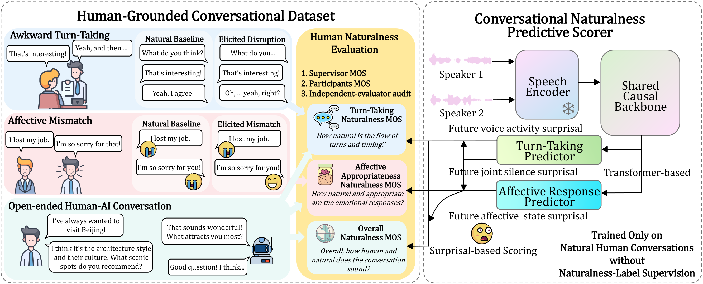

# CONTACT: A Human-Grounded Benchmark and Surprisal-Based Predictive Scorer for Conversational Naturalness

## [Open the audio/video sample gallery](https://review-anonymous-git.github.io/contact-samples/)

[Awkward Turn-Taking](https://review-anonymous-git.github.io/contact-samples/#awkward-turn-taking) | [Affective Mismatch](https://review-anonymous-git.github.io/contact-samples/#affective-mismatch) | [Human-AI Conversations](https://review-anonymous-git.github.io/contact-samples/#human-ai)

[Code](https://github.com/review-anonymous-git/contact-code) · [Browse and play samples](https://review-anonymous-git.github.io/contact-samples/) · [Media downloads](https://github.com/review-anonymous-git/contact-samples/releases/tag/samples-v1)

Example recordings from the three CONTACT subsets. H-H videos show both speakers side by side; H-AI videos show the human participant. All WAV and MOV audio has separate left and right speaker channels.

## Ratings

P = participant; S = supervisor. All scores are on a 1-5 scale and refer to the full recording. H-H P is shown separately for instructed and uninstructed participants. These roles refer to disruption instructions, not the conversation topic. Both individuals' scores are shown, including natural conversations (both uninstructed) and competitive floor conflict (both instructed). Left/right labels follow the displayed video and stereo channels. Unverified position mappings are marked explicitly. N/A indicates that the role is absent. Combined retains the paper definition: the mean of uninstructed P and S, using both participants' mean in place of P for natural conversations and competitive floor conflict. H-AI Combined is (P + S) / 2; cells list turn-taking / affective response / overall. These examples are illustrative, not a representative evaluation split.

## Awkward Turn-Taking

| Sample | Event / model | P (instructed) | P (uninstructed) | Supervisor | Combined | Media / details |
|---|---|---:|---:|---:|---:|---|
| tt-019 | Natural Baseline | N/A | Left: 5.00; Right: 5.00 | 5.00 | 5.00 | [Play](https://review-anonymous-git.github.io/contact-samples/#tt-019) · [WAV](https://github.com/review-anonymous-git/contact-samples/releases/download/samples-v1/tt-019.wav) · [MOV](https://github.com/review-anonymous-git/contact-samples/releases/download/samples-v1/tt-019.mov) · [Prompt](samples/awkward-turn-taking/tt-019/prompt.txt) · [Metadata](samples/awkward-turn-taking/tt-019/metadata.json) |
| tt-039 | Blocked Invited Response | Side unconfirmed: 1.00 | Side unconfirmed: 2.00 | 2.00 | 2.00 | [Play](https://review-anonymous-git.github.io/contact-samples/#tt-039) · [WAV](https://github.com/review-anonymous-git/contact-samples/releases/download/samples-v1/tt-039.wav) · [MOV](https://github.com/review-anonymous-git/contact-samples/releases/download/samples-v1/tt-039.mov) · [Prompt](samples/awkward-turn-taking/tt-039/prompt.txt) · [Metadata](samples/awkward-turn-taking/tt-039/metadata.json) |
| tt-004 | Competitive Floor Conflict | Left: 2.00; Right: 2.00 | N/A | 2.00 | 2.00 | [Play](https://review-anonymous-git.github.io/contact-samples/#tt-004) · [WAV](https://github.com/review-anonymous-git/contact-samples/releases/download/samples-v1/tt-004.wav) · [MOV](https://github.com/review-anonymous-git/contact-samples/releases/download/samples-v1/tt-004.mov) · [Prompt](samples/awkward-turn-taking/tt-004/prompt.txt) · [Metadata](samples/awkward-turn-taking/tt-004/metadata.json) |
| tt-065 | Fragmented Turn Holding | Side unconfirmed: 2.00 | Side unconfirmed: 2.00 | 2.00 | 2.00 | [Play](https://review-anonymous-git.github.io/contact-samples/#tt-065) · [WAV](https://github.com/review-anonymous-git/contact-samples/releases/download/samples-v1/tt-065.wav) · [MOV](https://github.com/review-anonymous-git/contact-samples/releases/download/samples-v1/tt-065.mov) · [Prompt](samples/awkward-turn-taking/tt-065/prompt.txt) · [Metadata](samples/awkward-turn-taking/tt-065/metadata.json) |
| tt-031 | Premature Entry | Side unconfirmed: 4.00 | Side unconfirmed: 1.00 | 3.00 | 2.00 | [Play](https://review-anonymous-git.github.io/contact-samples/#tt-031) · [WAV](https://github.com/review-anonymous-git/contact-samples/releases/download/samples-v1/tt-031.wav) · [MOV](https://github.com/review-anonymous-git/contact-samples/releases/download/samples-v1/tt-031.mov) · [Prompt](samples/awkward-turn-taking/tt-031/prompt.txt) · [Metadata](samples/awkward-turn-taking/tt-031/metadata.json) |
| tt-062 | Unmarked Turn Abandonment | Side unconfirmed: 2.00 | Side unconfirmed: 4.00 | 2.00 | 3.00 | [Play](https://review-anonymous-git.github.io/contact-samples/#tt-062) · [WAV](https://github.com/review-anonymous-git/contact-samples/releases/download/samples-v1/tt-062.wav) · [MOV](https://github.com/review-anonymous-git/contact-samples/releases/download/samples-v1/tt-062.mov) · [Prompt](samples/awkward-turn-taking/tt-062/prompt.txt) · [Metadata](samples/awkward-turn-taking/tt-062/metadata.json) |

## Affective Mismatch

| Sample | Event / model | P (instructed) | P (uninstructed) | Supervisor | Combined | Media / details |
|---|---|---:|---:|---:|---:|---|
| emo-359 | Natural Coordination | N/A | Left: 5.00; Right: 4.00 | 5.00 | 4.75 | [Play](https://review-anonymous-git.github.io/contact-samples/#emo-359) · [WAV](https://github.com/review-anonymous-git/contact-samples/releases/download/samples-v1/emo-359.wav) · [MOV](https://github.com/review-anonymous-git/contact-samples/releases/download/samples-v1/emo-359.mov) · [Prompt](samples/affective-mismatch/emo-359/prompt.txt) · [Metadata](samples/affective-mismatch/emo-359/metadata.json) |
| emo-360 | Valence Mismatch | Left: 1.00 | Right: 4.00 | 3.00 | 3.50 | [Play](https://review-anonymous-git.github.io/contact-samples/#emo-360) · [WAV](https://github.com/review-anonymous-git/contact-samples/releases/download/samples-v1/emo-360.wav) · [MOV](https://github.com/review-anonymous-git/contact-samples/releases/download/samples-v1/emo-360.mov) · [Prompt](samples/affective-mismatch/emo-360/prompt.txt) · [Metadata](samples/affective-mismatch/emo-360/metadata.json) |
| emo-361 | Under-Response | Right: 4.00 | Left: 2.00 | 3.00 | 2.50 | [Play](https://review-anonymous-git.github.io/contact-samples/#emo-361) · [WAV](https://github.com/review-anonymous-git/contact-samples/releases/download/samples-v1/emo-361.wav) · [MOV](https://github.com/review-anonymous-git/contact-samples/releases/download/samples-v1/emo-361.mov) · [Prompt](samples/affective-mismatch/emo-361/prompt.txt) · [Metadata](samples/affective-mismatch/emo-361/metadata.json) |
| emo-362 | Disproportionate Emotional Overreaction | Left: 2.00 | Right: 2.00 | 4.00 | 3.00 | [Play](https://review-anonymous-git.github.io/contact-samples/#emo-362) · [WAV](https://github.com/review-anonymous-git/contact-samples/releases/download/samples-v1/emo-362.wav) · [MOV](https://github.com/review-anonymous-git/contact-samples/releases/download/samples-v1/emo-362.mov) · [Prompt](samples/affective-mismatch/emo-362/prompt.txt) · [Metadata](samples/affective-mismatch/emo-362/metadata.json) |

## Open-Ended Human-AI Conversations

| Sample | Event / model | P | Supervisor | Combined | Media / details |
|---|---|---:|---:|---:|---|
| hai-179 | Gemini 3.1 Flash Live Preview | 5.00 / 5.00 / 5.00 | 3.00 / 1.00 / 3.00 | 4.00 / 3.00 / 4.00 | [Play](https://review-anonymous-git.github.io/contact-samples/#hai-179) · [WAV](https://github.com/review-anonymous-git/contact-samples/releases/download/samples-v1/hai-179.wav) · [MOV](https://github.com/review-anonymous-git/contact-samples/releases/download/samples-v1/hai-179.mov) · [Prompt](samples/human-ai/hai-179/prompt.txt) · [Metadata](samples/human-ai/hai-179/metadata.json) |
| hai-181 | Qwen3.5 Omni+ | 4.00 / 5.00 / 5.00 | 2.00 / 3.00 / 3.00 | 3.00 / 4.00 / 4.00 | [Play](https://review-anonymous-git.github.io/contact-samples/#hai-181) · [WAV](https://github.com/review-anonymous-git/contact-samples/releases/download/samples-v1/hai-181.wav) · [MOV](https://github.com/review-anonymous-git/contact-samples/releases/download/samples-v1/hai-181.mov) · [Prompt](samples/human-ai/hai-181/prompt.txt) · [Metadata](samples/human-ai/hai-181/metadata.json) |
| hai-182 | Cascade V1 | 2.00 / 3.00 / 5.00 | 1.00 / 1.00 / 1.00 | 1.50 / 2.00 / 3.00 | [Play](https://review-anonymous-git.github.io/contact-samples/#hai-182) · [WAV](https://github.com/review-anonymous-git/contact-samples/releases/download/samples-v1/hai-182.wav) · [MOV](https://github.com/review-anonymous-git/contact-samples/releases/download/samples-v1/hai-182.mov) · [Prompt](samples/human-ai/hai-182/prompt.txt) · [Metadata](samples/human-ai/hai-182/metadata.json) |
| hai-185 | Gemini 3.1 Flash Live Preview | 5.00 / 5.00 / 5.00 | 1.00 / 4.00 / 3.00 | 3.00 / 4.50 / 4.00 | [Play](https://review-anonymous-git.github.io/contact-samples/#hai-185) · [WAV](https://github.com/review-anonymous-git/contact-samples/releases/download/samples-v1/hai-185.wav) · [MOV](https://github.com/review-anonymous-git/contact-samples/releases/download/samples-v1/hai-185.mov) · [Prompt](samples/human-ai/hai-185/prompt.txt) · [Metadata](samples/human-ai/hai-185/metadata.json) |
| hai-188 | Qwen3.5 Omni+ | 4.00 / 4.00 / 4.00 | 2.00 / 4.00 / 2.00 | 3.00 / 4.00 / 3.00 | [Play](https://review-anonymous-git.github.io/contact-samples/#hai-188) · [WAV](https://github.com/review-anonymous-git/contact-samples/releases/download/samples-v1/hai-188.wav) · [MOV](https://github.com/review-anonymous-git/contact-samples/releases/download/samples-v1/hai-188.mov) · [Prompt](samples/human-ai/hai-188/prompt.txt) · [Metadata](samples/human-ai/hai-188/metadata.json) |
| hai-189 | Cascade V2 | 2.00 / 3.00 / 2.00 | 3.00 / 4.00 / 3.00 | 2.50 / 3.50 / 2.50 | [Play](https://review-anonymous-git.github.io/contact-samples/#hai-189) · [WAV](https://github.com/review-anonymous-git/contact-samples/releases/download/samples-v1/hai-189.wav) · [MOV](https://github.com/review-anonymous-git/contact-samples/releases/download/samples-v1/hai-189.mov) · [Prompt](samples/human-ai/hai-189/prompt.txt) · [Metadata](samples/human-ai/hai-189/metadata.json) |
| hai-190 | Moshi | 1.00 / 1.00 / 1.00 | 1.00 / 1.00 / 1.00 | 1.00 / 1.00 / 1.00 | [Play](https://review-anonymous-git.github.io/contact-samples/#hai-190) · [WAV](https://github.com/review-anonymous-git/contact-samples/releases/download/samples-v1/hai-190.wav) · [MOV](https://github.com/review-anonymous-git/contact-samples/releases/download/samples-v1/hai-190.mov) · [Prompt](samples/human-ai/hai-190/prompt.txt) · [Metadata](samples/human-ai/hai-190/metadata.json) |
| hai-192 | Gemini 3.1 Flash Live Preview | 4.00 / 3.00 / 4.00 | 4.00 / 3.00 / 2.00 | 4.00 / 3.00 / 3.00 | [Play](https://review-anonymous-git.github.io/contact-samples/#hai-192) · [WAV](https://github.com/review-anonymous-git/contact-samples/releases/download/samples-v1/hai-192.wav) · [MOV](https://github.com/review-anonymous-git/contact-samples/releases/download/samples-v1/hai-192.mov) · [Prompt](samples/human-ai/hai-192/prompt.txt) · [Metadata](samples/human-ai/hai-192/metadata.json) |

## Media Notes

WAV: 48 kHz, 16-bit stereo PCM. MOV: the same lossless audio; H-H video is composed at 1920 x 540 and 20 fps, while H-AI retains the participant video stream. MP4 is a compressed viewing copy, not the input for timing analysis.

H-AI left = human, right = AI. H-H channels follow ascending global speaker ID. Original stored time origins are retained; this is not a calibration of network or device offsets. Shorter audio channels are padded only at the end, with durations recorded in metadata.

The EM examples cover recordings 359-362. H-AI examples come from sessions 025 and 026 and jointly cover Gemini, Qwen, Moshi, Cascade V1 and Cascade V2. Nova Sonic is outside this example release. GPT-Live media is not publicly distributed under the project's release policy.

Transcripts are not included in this first example release. Direct identifiers and private annotation fields are omitted from metadata; faces and voices remain identifiable. The overview graphic is reproduced from the paper.

## Privacy

Gender is not disclosed and ages are reported only in ranges, in accordance with the study's IRB privacy requirements.

Age bands follow the paper: 18-27, 28-37, 38-47, 48-57 and 58+ years. Missing ages are null. H-H age ranges describe an unordered pair, not a verified mapping to individual speaker IDs or channels.

## Terms

No open-data license has been granted in this repository. Access to examples does not by itself grant permission to redistribute recordings or use them for model training. Refer to the authors' eventual data-use terms.
